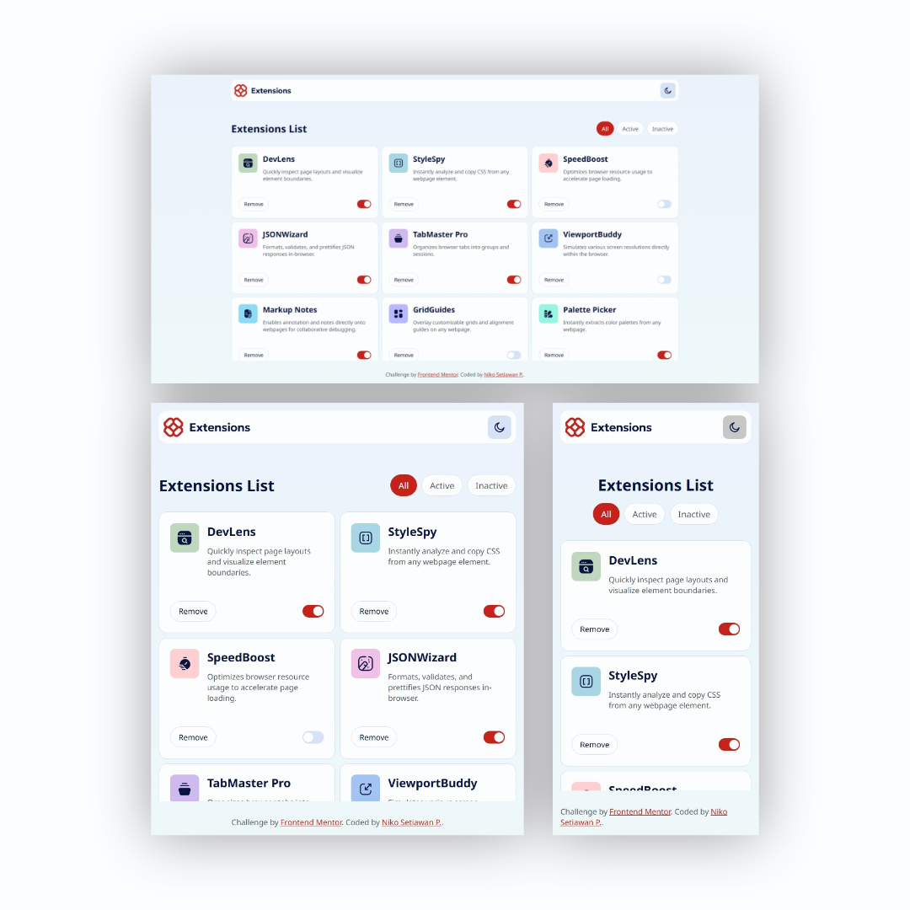
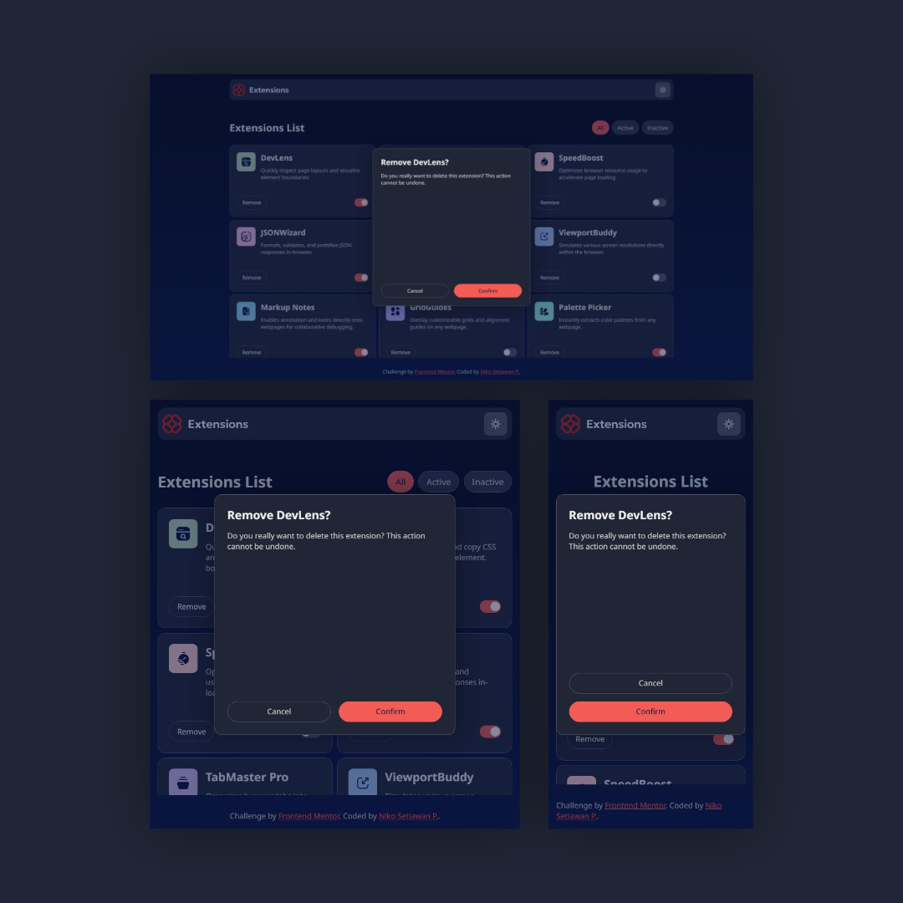

# Frontend Mentor - Browser extensions manager UI solution

This is a solution to the [Browser extensions manager UI challenge on Frontend Mentor](https://www.frontendmentor.io/challenges/browser-extension-manager-ui-yNZnOfsMAp). Frontend Mentor challenges help you improve your coding skills by building realistic projects. 

## Table of contents

- [Overview](#overview)
  - [The challenge](#the-challenge)
  - [Screenshot](#screenshot)
  - [Links](#links)
- [My process](#my-process)
  - [Built with](#built-with)
  - [What I learned](#what-i-learned)
  - [Continued development](#continued-development)
  - [Useful resources](#useful-resources)
- [Author](#author)
- [Acknowledgments](#acknowledgments)

## Overview

### The challenge

Users should be able to:

- Toggle extensions between active and inactive states
- Filter active and inactive extensions
- Remove extensions from the list
- Select their color theme
- View the optimal layout for the interface depending on their device's screen size
- See hover and focus states for all interactive elements on the page

### Screenshot




### Links

- Solution URL: [https://github.com/nikosetiawanp/browser-extensions-manager-ui-maine](https://github.com/nikosetiawanp/browser-extensions-manager-ui-main)
- Live Site URL: [https://nikosetiawanp.github.io/browser-extensions-manager-ui-main/](https://nikosetiawanp.github.io/browser-extensions-manager-ui-main/)

## My process

### Built with
- HTML
- Vanilla CSS
- Vanilla Javascript

### What I learned

After using React JS and various UI library for a long time, I decided to give this challenge a go using vanilla CSS and JS.

I thought it would be easy because I have some knowledge with frameworks. Well, I got humbled pretty quick. I struggled to do the css and simple javascript functionality, particularly targeting and manipulating DOM.I don't even have time to check if my HTML is semantic.

Here's what I learned :
- It's good to do projects in vanilla JS and CSS so you won't forget the fundamentals. It will make you a better developer in the long run.

### Continued development
❌ I rely too much on template-literal, and from what I learned, it's not good for security.
``` 
// TEMPLATE LITERAL
const user = { name: 'Alice', age: 25 };
container.innerHTML = `
  <div class="user-card">
    <h2>${user.name}</h2>
    <p>Age: ${user.age}</p>
  </div>
`;
```

✅  In the future, I wish to implement more DOM-based approach whenever possible.
```
const user = { name: 'Alice', age: 25 };

const card = document.createElement('div');
card.className = 'user-card';

const name = document.createElement('h2');
name.textContent = user.name;

const age = document.createElement('p');
age.textContent = `Age: ${user.age}`;

card.append(name, age);
container.innerHTML = '';
container.appendChild(card);
```

## Author

- Website - [https://github.com/nikosetiawanp](https://github.com/nikosetiawanp)
- Frontend Mentor - [@nikosetiawanp](https://www.frontendmentor.io/profile/yourusername)
